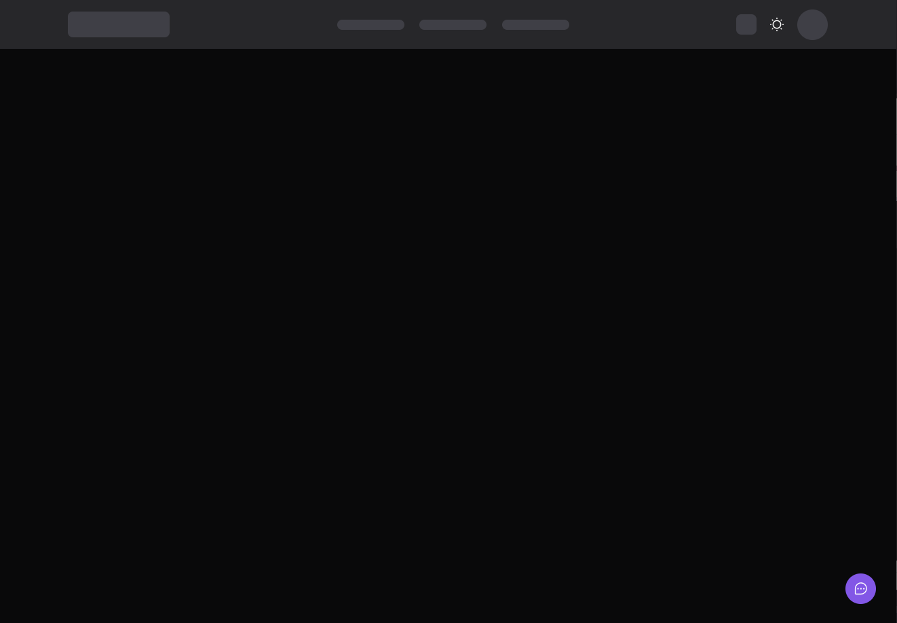
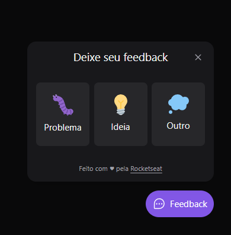
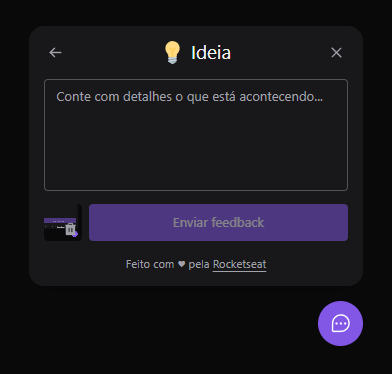
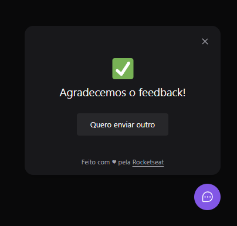

# Feedback widget

---

<br><br>

## Funcionalidades

---

<br>

Feedback widget é um botão flutuante que você pode selecionar o tipo de feedback que deseja enviar, uma descrição e um print da tela, que ao clicar no ícone, ele tira um printa para você e depois envia o feedback para o email do site. Além disso, você consegue acessar e enviar o feedback com apenas o teclado.

<br>

Esse projeto foi criado no nlw 8 - Return da [Rocketseat](https://www.rocketseat.com.br/) 💜

<br>

### Me manda um feedback da aplicação! [Clique aqui!](https://feedback-widget-gabynk.vercel.app/)

<br><br><br>


## 🛠 Tecnologias

---

<br>

As seguintes ferramentas foram usadas na construção do projeto:
<br>

### Backend

- [Node.js](https://nodejs.org/en/)
- [Typescript](https://www.typescriptlang.org/)
- [Nodemailer](https://nodemailer.com/about/)
- [Handlebarsjs](https://handlebarsjs.com/)
- [Prisma](https://www.prisma.io/)
- [Jest](https://jestjs.io/docs/getting-started)

<br>

### Frontend

- [React](https://pt-br.reactjs.org/)
- [Typescript](https://www.typescriptlang.org/)
- [Tailwindcss](https://tailwindcss.com/)
- [Vite](https://vitejs.dev/)
- [Jest](https://jestjs.io/docs/getting-started)

<br>

### Mobile

- [React Native](https://reactnative.dev/)
- [Typescript](https://www.typescriptlang.org/)

<br><br><br>

## Imagens do widget

---

<br>

 
<br><br>

 

<br><br>
<br><br>

<br>

## 🎲 Rodando o jogo

---

<br>
Instale node_modules

```bash
npm install
```

Rode o backend

```bash
npm run dev
```

Rode a aplicação web

```bash
npm run dev
```

Rode a aplicação no android ou ios

```bash
npx react-native run-android
npx react-native run-ios
```

<br><br>


## Melhorias futuras

---

<br>

- <input type="checkbox" disabled checked /> tema light/dark
- <input type="checkbox" disabled checked /> persistir o tema escolhido mesmo com reload
- <input type="checkbox" disabled checked /> responsividade com tailwind
- <input type="checkbox" disabled checked /> melhorar html/css do email
- <input type="checkbox" disabled /> criar dashboard de feedbacks
  - <input type="checkbox" disabled /> listas de feedbacks
- <input type="checkbox" disabled /> autenticação (firebase ou oauth)

<br><br><br>

---

<center>Desenvolvido com 💜 por  **Gabriele Nakassima**</center>